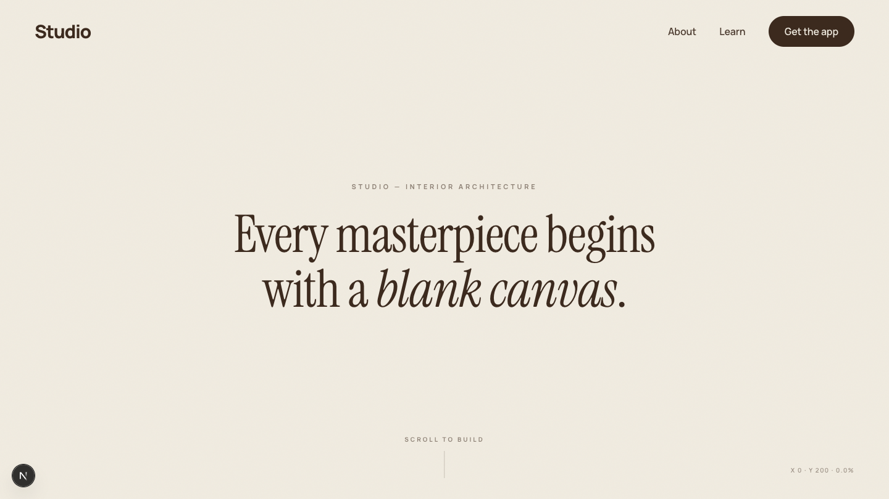
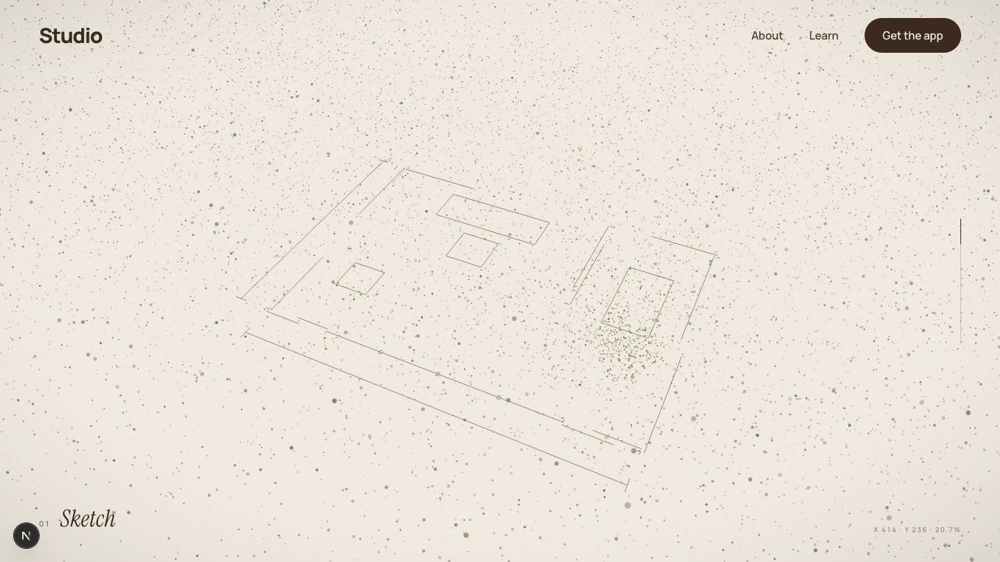
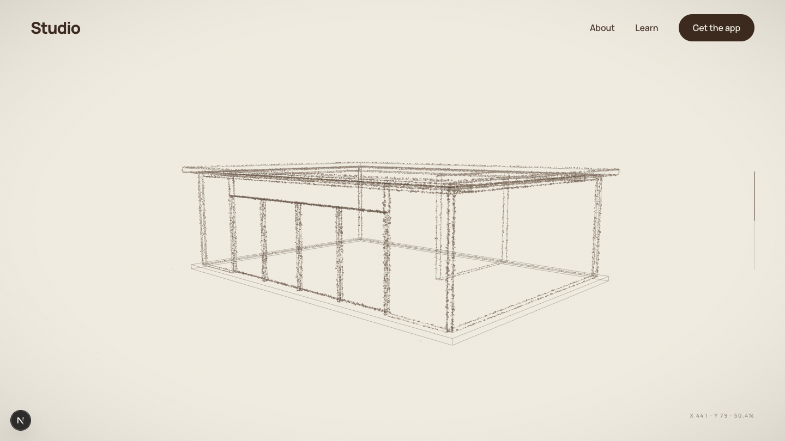
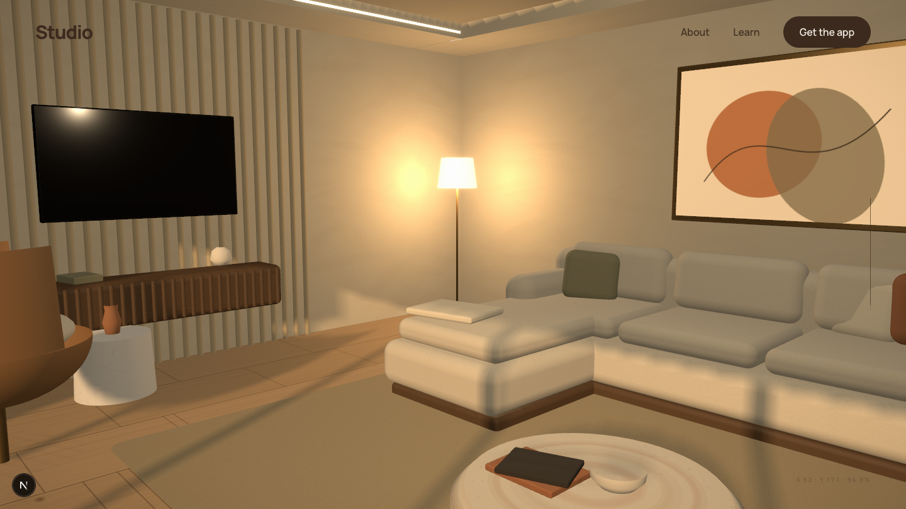

# Studio

**Every masterpiece begins with a blank canvas.**

An interactive cinematic homepage for an interior architecture studio. The page opens as an empty sheet of paper — scroll, and you watch imagination become architecture: ink particles gather, a blueprint draws itself, walls rise as wireframe, materials grow, the lights come on, and the camera walks you into a finished golden-hour interior before handing off to the portfolio.

## The experience

| | |
|---|---|
|  |  |
| **Blank canvas** — warm paper, nothing else | **Sketch** — the floor plan drafts itself in CAD linework |
|  |  |
| **Structure** — 22,000 particles condense into the wireframe | **Inhabit** — a designed interior at eye level |

### Scroll timeline

1. **Blank canvas** — cream paper, a headline, a hint to scroll
2. **Sketch** — drafting grid and floor plan draw on stroke by stroke, with dimension ticks
3. **Structure** — the particle cloud condenses onto the building's edges; wireframe walls rise from the slab in staggered order
4. **Material** — faces crossfade from wireframe to textured plaster, concrete, glass and bronze; designer furniture grows from the floor
5. **Light** — golden-hour sun, cove lighting, lamps and pendants warm up with soft bloom
6. **Inhabit** — the camera dollies through the glazing and rests inside the living room
7. The portfolio scrolls seamlessly over the glowing interior

### Interactions

- **Move** the cursor — particles follow it
- **Pause** — particles gather around the cursor
- **Click** — plants a blueprint anchor (a CAD survey mark particles fall into)
- **Long strokes** — particles trace the cursor's path like pencil lines

## The interior

Everything is procedural — no imported models, no image assets:

- **Furniture** — low sectional with chaise and throw pillows, leather swivel lounge chair, travertine drum coffee table, marble side table, floating fluted walnut console + TV, oval dining table on bronze pedestals, upholstered dining chairs, fluted sideboard
- **Materials** — canvas-painted maps for wide-plank oak, walnut, banded travertine, veined marble, bouclé and troweled plaster; brass, bronze, leather, ceramic, terracotta, smoked glass
- **Architecture** — limed-oak fluted feature wall, walnut slat screen, dropped ceiling border with hidden cove lighting, brass-framed generative artwork, floating shelves
- **Styling** — books, vases with dry branches, an olive tree, sheer drapes, and a garden with stone path, hedges and trees beyond the glass

## Tech stack

- [Next.js 15](https://nextjs.org/) + React 19 (TypeScript)
- [React Three Fiber](https://docs.pmnd.rs/react-three-fiber) / [Three.js](https://threejs.org/)
- GLSL vertex-shader particle simulation — all 22k particles move statelessly on the GPU in a single draw call
- [GSAP ScrollTrigger](https://gsap.com/docs/v3/Plugins/ScrollTrigger/) + [Lenis](https://lenis.darkroom.engineering/) smooth scroll
- [Framer Motion](https://www.framer.com/motion/) for DOM reveals
- [postprocessing](https://github.com/pmndrs/postprocessing) — bloom + vignette

Runs at 60 FPS: one particle draw call, instanced fluting/slats, a single scroll-scrubbed timeline shared through a module store (no React re-renders on scroll or pointer).

## Getting started

```bash
npm install
npm run dev
```

Open [http://localhost:3000](http://localhost:3000) and scroll.

```bash
npm run build && npm start   # production
```

## Project structure

```
app/                    layout, page, global styles
components/
  Navbar.tsx            fixed nav (About / Learn / Get the app)
  Hud.tsx               intro headline, scroll hint, progress meter
  Works.tsx             portfolio, studio statement, footer
  useScrollRig.ts       Lenis + ScrollTrigger → shared progress store
  three/
    Experience.tsx      <Canvas> entry
    Scene.tsx           frame-loop driver, lights, composition
    Particles.tsx       GPU particle field (GLSL)
    Blueprint.tsx       draw-on CAD linework
    Building.tsx        rising architecture
    Interior.tsx        designed furniture, styling, garden
    CameraRig.tsx       cinematic dolly path
    Anchors.tsx         click-to-anchor survey marks
    Effects.tsx         bloom + vignette
lib/
  store.ts              shared mutable state (scroll, pointer, anchors)
  house.ts              the building, authored as data
  textures.ts           procedural material maps (canvas-painted)
```

---

Built with [Claude Code](https://claude.com/claude-code).
